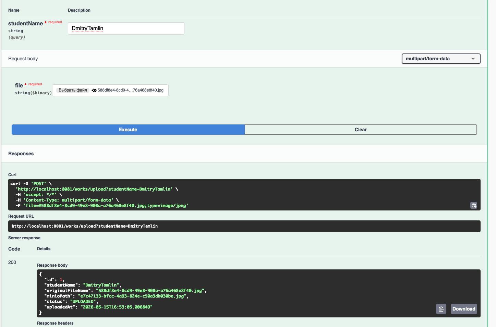
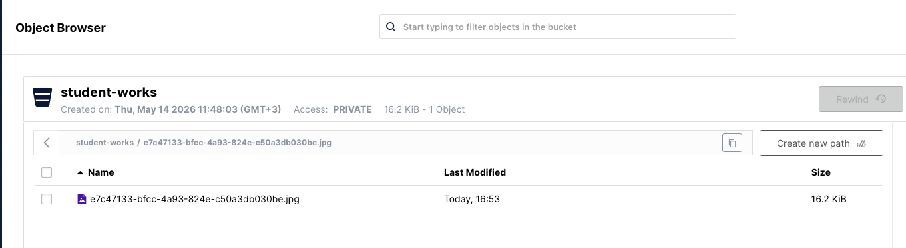
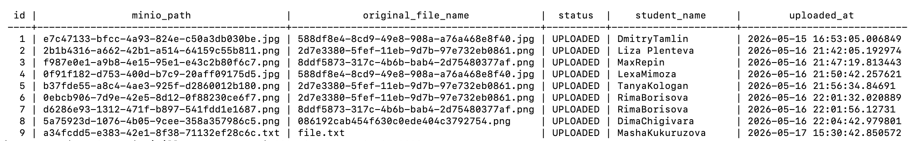
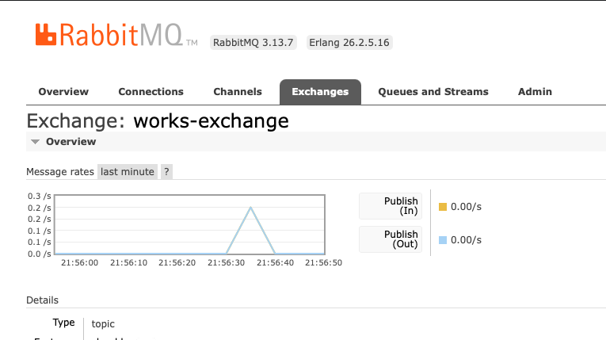
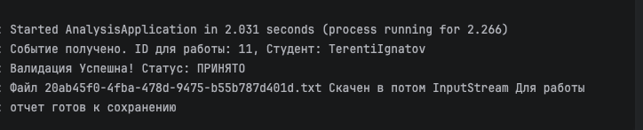
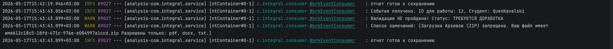
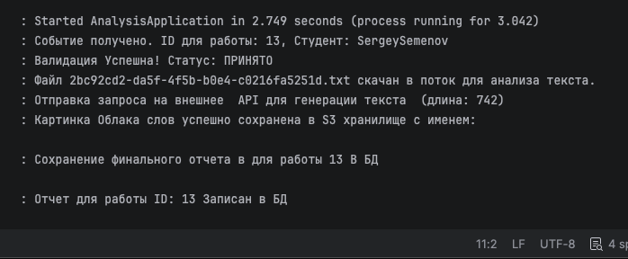
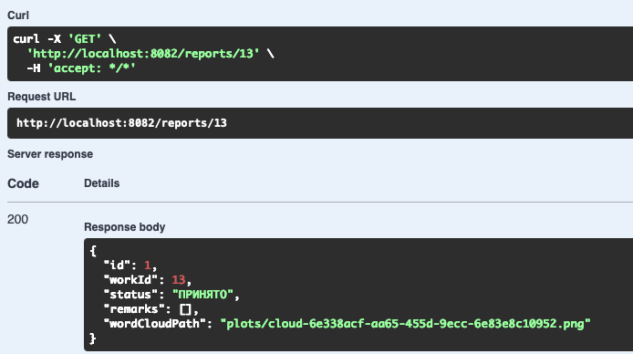
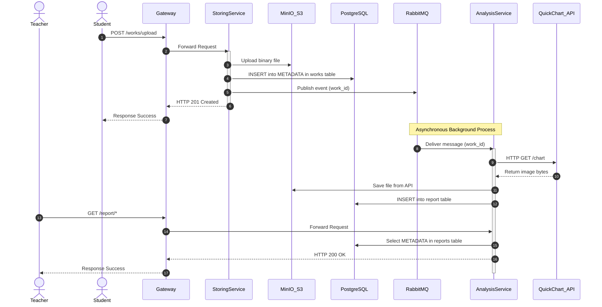
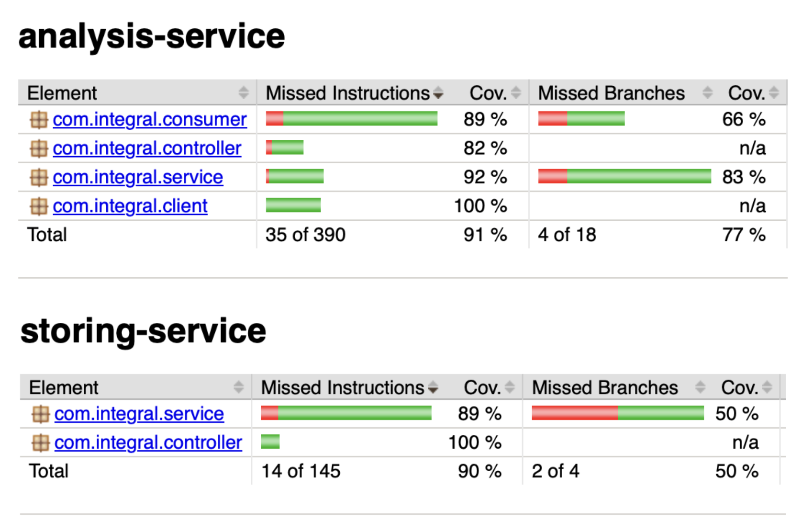

# 📊 Архитектура распределенной системы интеграции и анализа данных (Inter-Service Integration)

🚀 **Проект по интеграции микросервисов, асинхронному обмену данными и автоматизированному анализу артефактов.**

---

## 📝 1. Подробное описание проделанной работы

В рамках данного проекта спроектирована и реализована отказоустойчивая микросервисная архитектура для загрузки, распределенного хранения и последующего асинхронного анализа студенческих работ.

### Основные компоненты системы:

**1. `gateway-service` (API Gateway)** Единая точка входа, обеспечивающая абстракцию микросервисной архитектуры для клиента.
* Прозрачно перенаправляет запросы на целевые микросервисы (`storing-service` или `analysis-service`), скрывая внутреннюю топологию сети.
* Выступает централизованным узлом для управления трафиком, логирования запросов и масштабирования системы без внесения изменений в бизнес-логику отдельных сервисов.

**2. `storing-service` (Сервис хранения)** Реализует REST API для приема файлов и сопутствующих метаданных.
* Обеспечивает персистентность данных: метаданные транзакционно сохраняются в реляционную СУБД **PostgreSQL**, а физические файлы отправляются в S3-совместимое объектное хранилище **MinIO**.
* Инициирует событийно-ориентированное взаимодействие, публикуя сообщения о новых артефактах в брокер **RabbitMQ**.

  
   
  <i>Рисунок 1. Успешный POST-запрос на отправку файла с заданием и метаданными студента.</i>

  
   
  <i>Рисунок 2. Успешная загрузка физического файла в изолированный бакет MinIO (S3).</i>

  
   
  <i>Рисунок 3. Сохранение метаданных загруженной работы в таблицу реляционной БД.</i>

**3. `analysis-service` (Сервис анализа)** Работает в фоновом режиме, асинхронно потребляя сообщения из очереди RabbitMQ.
* Извлекает текстовое содержимое работ, выполняет синтаксический разбор и строгую валидацию данных.
* Интегрирован с внешним REST API (генерация облака тегов/ключевых слов через HTTP-клиент `WordCloudClient`) 

  
   
  <i>Рисунок 4. Маршрутизация и доставка сообщения через Exchange в очередь RabbitMQ.</i>

  
   
  <i>Рисунок 5. Успешное принятие данных и прохождение этапа валидации.</i>

  
   
  <i>Рисунок 6. Обработка ошибки: валидация не пройдена, сформирован детализированный список нарушений.</i>

  
   
  <i>Рисунок 7. Интеграция с внешним API (quickchart.io/wordcloud): сохранение метаданных в БД и сгенерированного .png отчета в S3.</i>

  
   
  <i>Рисунок 8. GET-запрос для получения итоговой информации о результатах проверки и привязанных метаданных.</i>

---

## 🔄 2. Технические сценарии и взаимодействие (Data Flow)

Система построена на принципах слабой связанности (Loose Coupling) и асинхронного взаимодействия.

### Пошаговый технический сценарий:
1. **Загрузка (Client -> REST):** Клиент отправляет `Multipart` HTTP POST-запрос на эндпоинт `storing-service`.
2. **Изоляция данных:** Бизнес-логика разделяет запрос: бинарный поток (файл) загружается в корзину **MinIO**. Метаданные (информация о студенте, задании, времени отправки, статусе) валидируются через `jakarta.validation` и сохраняются в **PostgreSQL** в рамках единой ACID-транзакции.
3. **Публикация события:** После успешного коммита в БД, `storing-service` отправляет JSON-сообщение в Exchange брокера **RabbitMQ**. Клиент мгновенно получает ответ `201 Created`, не дожидаясь окончания тяжелого анализа.
4. **Асинхронное потребление:** `analysis-service` через `@RabbitListener` извлекает событие из очереди.
5. **Внешняя интеграция:** Сервис анализа запрашивает данные, подготавливает текст и вызывает внешнее API через `WordCloudClient` для построения визуального отчета. При падении сети срабатывает защитный `catch`-блок, сохраняющий консистентность системы.
6. **Обновление статуса:** Результаты анализа фиксируются в базе данных, переводя статус работы в финальное состояние.

---

## 🗺️ 3. Модели и диаграммы системы

### Диаграмма взаимодействия микросервисов (Sequence Diagram)
Ниже представлена интерактивная диаграмма последовательности, описывающая полный жизненный цикл обработки запросов в системе.

### Покрытие кода тестами (JaCoCo Report)
Локальные метрики верификации качества кода исключают служебные структуры данных, гарантируя проверку только бизнес-логики.

  
   
  <i>Рисунок 10. Интерактивный отчёт покрытия кода тестами JaCoCo (Total Coverage).</i>

